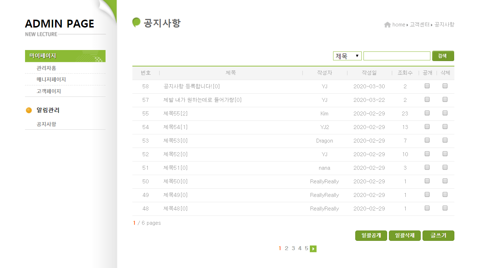
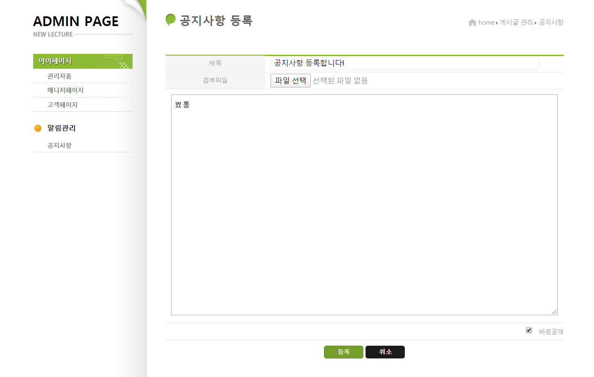
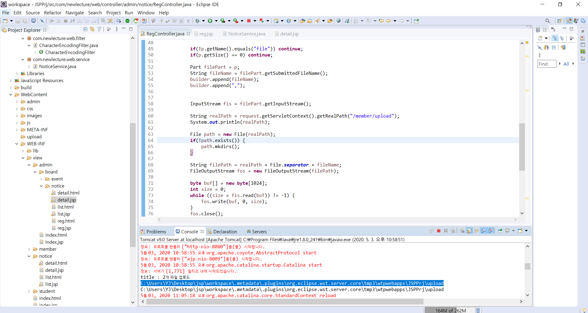
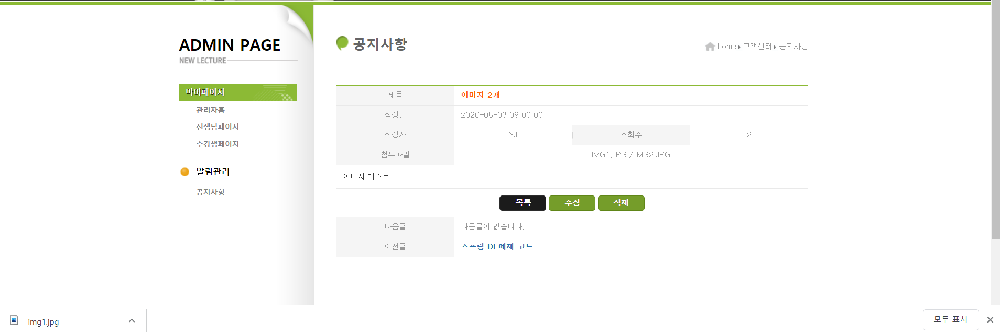

# Web_NoticeBoard

## USE

- Servlet
- JSP
- JDBC
- Tomcat
- MySQL

  

> ## Abstract

MVC2 패턴으로 공지사항 게시판을 구현했습니다.  

- 웹페이지에서 게시글 등록, 삭제
- DB에 저장되어있는 데이터 웹페이지에 표기
- 제목 또는 작성자로 검색
- 관리자 기능(글 삭제 권한)
- 각 화면에 맞는 page 및 다음 5페이지 indexing
- 파일 업로드 (여러개의 파일 업로드 가능)

 
JSSPrj_fileUpload(최종본)를 확인해주세요.  
 

HTTP GET과 POST 방식을 사용하여 Client의 요청을 처리했습니다.
Filter를 사용하여 request, response에 UTF-8으로 인코딩했습니다. 
Controller는 Servlet으로, View는 JSP로 구현했습니다. JDBC를 활용해 MySQL DB를 연동했습니다. 데이터를 가공해 Entity에 담아 JSP EL을 활용해 Model로 활용했습니다. 또한, JSTL을 사용하여 효율을 더했습니다.
  
데이터의 유지가 필요할 때 Forwarding방식, 그렇지 않을 때 Redirect를 활용하여 페이지를 전환했습니다. HTTP 통신의 인코딩 타입을 multipart/form-data로 설정하여 파일 업로드 기능을 구현했습니다.
  

> ## 공지사항 리스트

> ## 공지사항 등록

> ## 파일 업로드

> ## Reference

newlecture.com

